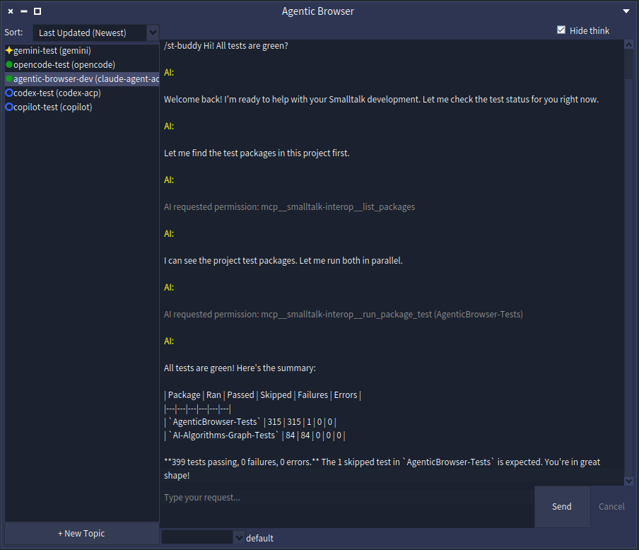
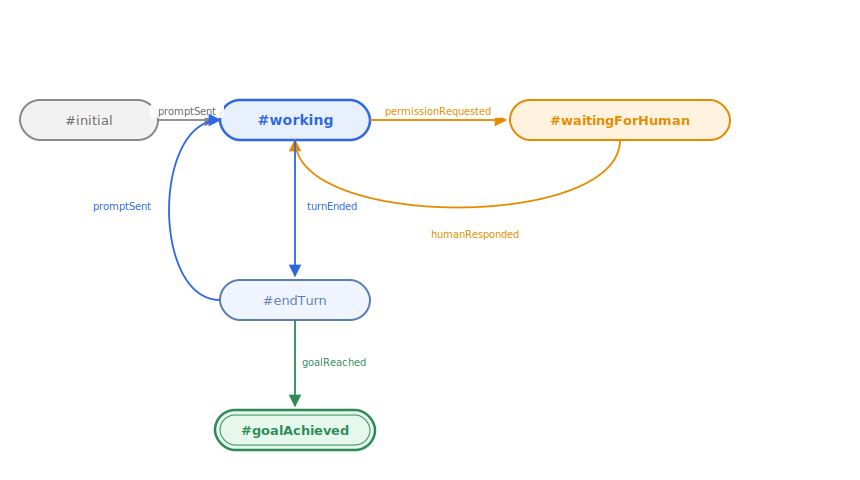

<style>
/* Section divider slides: larger heading */
section.section h2 {
  font-size: 56px;
}
</style>

<!-- _class: title -->
<!-- _paginate: false -->

<style scoped>
section {
  justify-content: center;
  align-items: center;
  gap: 12px;
  text-align: center;
}
section > h1:first-child {
  position: static !important;
  width: auto !important;
  height: auto !important;
  padding-left: 0 !important;
  font-size: 72px;
}
section > h1:first-child::after {
  display: none !important;
}
</style>

# Introducing pharo-agentic-browser

### **Multi-Agent Session Manager for Pharo Smalltalk**
Masashi Umezawa
https://github.com/mumez/pharo-agentic-browser

---

<!-- _class: section -->
<!-- _paginate: false -->

<style>
.highlight-box {
  margin-top: 32px;
  background-color: #e8f0fe;
  border-left: 6px solid var(--blue-very-deep);
  padding: 24px 32px;
  border-radius: 0 8px 8px 0;
  font-size: 30px;
}
</style>

## What is pharo-agentic-browser?

---

<!-- _class: content-image -->

# pharo-agentic-browser

<div class="highlight-box">
A <strong>Pharo-native GUI tool</strong> for managing multiple AI coding agent sessions — Claude Code, Gemini CLI, OpenCode, and others — in parallel from inside your Pharo image.
</div>

---

<!-- _class: content-image -->

# At a Glance



---

# Core Workflow

Each session is called a **topic**:

1. Create a topic and select an ACP-compatible agent
2. Type a request + mention code with `@ClassName` or attach a screenshot
3. The AI works autonomously (task decomposition, code changes, tests)
4. When the AI needs approval, it pauses and asks in the chat
5. Respond with pulldown selection — the AI resumes
6. Topic status is always visible in the sidebar

---

<!-- _class: section -->
<!-- _paginate: false -->

## Motivation

---

# AI GUI Tools Are Going Mainstream

Dedicated GUI tools for AI coding agents are becoming standard:

- **Claude Desktop** — Claude with tools, MCP, and file access
- **Codex Desktop** — OpenAI's autonomous coding environment
- **Cursor / Windsurf** — AI-native editors

These tools lower the barrier for interacting with AI agents beyond simple chat.

---

# The Shift: IDE → Multi-Agent Delegation

<style scoped>
table { font-size: 26px; }
</style>

| Era | Paradigm | Examples |
|-----|----------|---------|
| Early | Chat in editor sidebar | ChatGPT, GitHub Copilot |
| Now | AI-first IDE with agent mode | Cursor, Windsurf |
| Emerging | **Delegate full tasks to agents** | Antigravity 2.0, Codex Desktop |

The AI can now handle **entire feature-level tasks**, not just line completions.

Tools are evolving: the UI is no longer "editor + chat" — it's **session orchestration**.

---

# Why Pharo Needs This Too

Pharo developers should be able to leverage the same paradigm:

- **Rich live environment** — classes, methods, and runtime are right there
- **pharo-acp** already provides ACP client support for multiple agents
- **Multiple projects** can run in parallel in one image

<div class="highlight-box">
A Pharo-native GUI that can control multiple AI agents is the natural next step.
</div>

---

# Key Advantages Over Generic Tools

| Advantage | Details |
|-----------|---------|
| **Direct context passing** | `@ClassName`, `@Class>>method`, screenshot — no copy-paste |
| **Agent-agnostic** | Works with any ACP agent via pharo-acp |
| **Pharo-integrated** | Tests, code export, change watching all use the live image |
| **Parallel sessions** | Run several agents on different topics simultaneously |

---

<!-- _class: section -->
<!-- _paginate: false -->

## Installation

---

# Installation — Pharo Side

Open a Playground in a Pharo 12+ image and evaluate:

```smalltalk
Metacello new
    baseline: 'AgenticBrowser';
    repository: 'github://mumez/pharo-agentic-browser:main/src';
    load.
```

Then open the browser:

```smalltalk
AgenticBrowser open.
```

---

# Installation — Agent Side

Any ACP-compatible agent - preset list:

| Agent | Install |
|-------|---------|
| **Claude Code** | `npm install -g @agentclientprotocol/claude-agent-acp` |
| **Codex** | `npm install -g @agentclientprotocol/codex-acp` |
| **Gemini CLI** | ACP built-in (`gemini --acp`) |
| **Copilot CLI** | ACP built-in (`copilot --acp --stdio`) |
| **Cursor CLI** | ACP built-in (`agent acp`) |

Also supported: OpenCode, Kilo Code, Kiro CLI and more 

> **Recommended**: Install [smalltalk-dev-plugin](https://github.com/mumez/smalltalk-dev-plugin) in your agent for better Smalltalk

---

<!-- _class: section -->
<!-- _paginate: false -->

## Basic Features

---

# Creating a Topic

1. Click **+ New Topic**
2. Enter a title and select an agent
3. (Optional) Set an existing project directory
4. Click **Create** — topic appears in the left sidebar
5. (Optional) Right-click → **Set Target Packages...** to configure tracked packages

<div class="highlight-box">
The first message is automatically prefixed with <code>/st-buddy</code> to activate the Smalltalk buddy agent mode.
</div>

---

<!-- _class: image -->

# Topic States

Each topic follows a clear state machine:



---

# Topic State Icons

| Icon | State | Meaning |
|------|-------|---------|
| `❇️` | working | AI is actively running |
| `?` | waitingForHuman | AI needs approval |
| `●` | endTurn | Turn completed |
| `✓` | goalAchieved | Goal reached |

---

# Human-in-the-Loop

When the AI requests permission:

- Status changes to `?` (waitingForHuman)
- **Send** button becomes **Allow**
- **Cancel** button becomes **Deny**

Respond by clicking the button — the AI resumes seamlessly.

<div class="highlight-box">
No modal dialogs. Approval is part of the conversation flow.
</div>

---

# Code Mentions

Reference Pharo classes or methods directly in the chat:

```
@QueryClass @DBAdapter>>connect please refactor this
```

AgenticBrowser resolves each `@mention` to its Tonel source and attaches it as an ACP text resource — **no copy-paste needed**.

### Drag and Drop

- Drag a **class** from the System Browser → inserts `@ClassName`
- Drag a **method** from the System Browser → inserts `@ClassName>>methodName`

---

# Screen Captures

Click the **`[ ]`** button to attach a screenshot:

1. Click the button — cursor becomes a crosshair
2. Drag to select the area
3. A mention like `@sc-20260528-001.png` is inserted in the input
4. Send — the PNG is attached as an image resource to the prompt

Files are saved to `<agenticBrowserRoot>/screenshots/sc-YYYYMMDD-NNN.png`.

---

# File Attachments

Click the **+** button to attach any file from disk:

1. Click the button — a file selection dialog opens
2. Choose a file — a mention like `[filename]` is inserted in the input
3. Send — the file's contents are attached as a text resource

<div class="highlight-box">
Oversized files are truncated to <code>maxAttachmentSize</code> (default 5MB) before being embedded in the prompt.
</div>

Removing the `[filename]` mention text before sending cancels the attachment.

---

# Goal Setting

Right-click a topic → **Set Goal...** to enter a completion condition:

```
all tests pass
```

AgenticBrowser sends a goal prompt to the AI:

> *Goal has been set: all tests pass. When the goal is achieved, summarize and report in result-<topic-id>.md. Keep retrying until the goal is achieved.*

When `result-<topic-id>.md` is created, the topic transitions to `✓` (`#goalAchieved`).

---

# Goal Achievement Hooks

Two hooks fire when a goal is reached:

### Announcement

```smalltalk
topic announcer
    when: AbTopicGoalAchieved
    do: [:ann | Transcript crShow: ann topic title , ' achieved: ' , ann goal result].
```

### Callback Block

```smalltalk
topic whenGoalAchieved: [:goal | Transcript crShow: goal result].
```

Integrate goal events into your own automation workflows.

---

# Session Persistence

Topics are automatically saved to `ab-topics.fuel` using Pharo's **Fuel** serializer — they survive image restarts.

Manual save/restore:

```smalltalk
AbTopicManager save.
AbTopicManager load.
```

Per-topic state (settings, status, conversation) is fully persisted.

---

# Image Change Watching

AgenticBrowser watches the image for edits to a topic's tracked packages:

- Right-click a topic → **Set Target Packages...** to configure prefixes (e.g. `#('AgenticBrowser-*')`)
- When a matching class/method is saved, a system message appears in chat and the package is exported after confirmation
- Edits to **untracked** packages are collected — promote them via **Apply Updated External Packages**

<div class="highlight-box">
Keeps the AI's view of the Tonel source in sync with whatever you (or the AI) change live in the image.
</div>

---

<!-- _class: section -->
<!-- _paginate: false -->

## Customization

---

# Topic Template

Every new topic's working directory is seeded from `<agenticBrowserRoot>/topic-template`:

- Ships with a default `CLAUDE.md` / `AGENTS.md` tuned for the `smalltalk-dev-plugin`
- Drop in `.claude`, `.opencode`, or other agent config directories — skills, commands, rules shared across all topics
- Replace the defaults with your own customized versions any time

<div class="highlight-box">
Saves you from reconfiguring the coding agent for every new topic. Not applied when a topic points at an existing project directory.
</div>

---

# Adding MCP Servers

Place `mcp.json` in your AgenticBrowser root directory:

```json
{
  "mcpServers": {
    "my-server": {
      "command": "uvx",
      "args": ["my-server-package"],
      "env": {"API_KEY": "value"}
    }
  }
}
```

- Built-in `smalltalk-interop` and `smalltalk-validator` servers are **auto-merged** by default
- Set `useDefaultMcpServers: false` to use only your own `mcp.json`

---

# Adding Custom Agents

### From a Playground

```smalltalk
AbSettings default codingAgents: (AbSettings default codingAgents copyWith:
    {'name' -> 'my-agent'.
    'command' -> #('my-agent' '--acp')} asDictionary).
AbSettings save.
```

### Or edit `ab-settings.json` directly

The agent appears as a preset in the **New Topic** dialog on next open.

---

# Global Settings

| Key | Default | Description |
|-----|---------|-------------|
| `useDefaultMcpServers` | `true` | Merge built-in Smalltalk MCP servers |
| `aiPermissionWaitTimeoutSeconds` | `1800` | Timeout for human approval |
| `aiPermissionTimeoutOption` | `#reject_once` | Auto-response: `allow_once`, `allow_always`, `reject_once` |
| `exportApprovalWaitTimeoutSeconds` | `30` | Timeout for package export approval |

Settings can also be configured **per-topic** via right-click → **Edit Settings...**

---

# Other Interfaces: Web UI & Scripting API

Two more ways to work with AgenticBrowser, beyond the Spec UI:

- **Web UI** — browser-based interface over WebSocket; mobile friendly, live topic updates
  → [Web UI slides](https://mumez.github.io/pharo-agentic-browser-slides/pharo-agentic-browser-web-ui-en.html)
- **Scripting API** — headless DSL to build and run multi-topic orchestrations from code (sequential / parallel steps, save & load)
  → [Scripting API slides](https://mumez.github.io/pharo-agentic-browser-slides/pharo-agentic-browser-scripting-en.html)

---

<!-- _class: section -->
<!-- _paginate: false -->

## Summary

---

# Summary

**pharo-agentic-browser** brings the multi-agent delegation paradigm to Pharo:

- **Native GUI** — manage multiple AI sessions without leaving your image
- **Agent-agnostic** — any ACP-compatible agent works
- **Rich context** — code mentions, drag-and-drop, screen captures
- **Human-in-the-loop** — conversational approval, no interruption dialogs
- **Goal-driven** — set completion conditions, hook into results
- **Extensible** — custom MCP servers and agents with minimal configuration

---

<!-- _class: all-text-center align-center -->
<!-- _paginate: false -->

# **Feedback and contributions are welcome!**

https://github.com/mumez/pharo-agentic-browser
