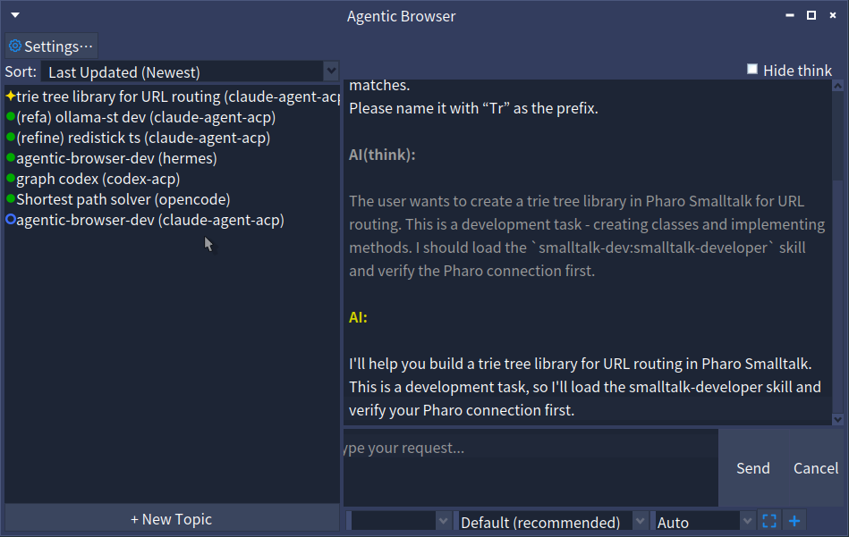
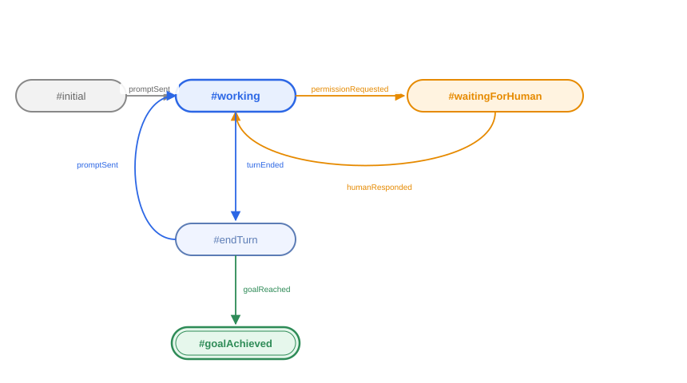

<style>
/* Section divider slides: larger heading */
section.section h2 {
  font-size: 56px;
}
</style>

<!-- _class: title -->
<!-- _paginate: false -->

<style scoped>
section {
  justify-content: center;
  align-items: center;
  gap: 12px;
  text-align: center;
}
section > h1:first-child {
  position: static !important;
  width: auto !important;
  height: auto !important;
  padding-left: 0 !important;
  font-size: 72px;
}
section > h1:first-child::after {
  display: none !important;
}
</style>

# pharo-agentic-browser の紹介

### **Pharoの統合AIコーディング環境**
梅澤 真史
https://github.com/mumez/pharo-agentic-browser

---

<!-- _class: section -->
<!-- _paginate: false -->

<style>
.highlight-box {
  margin-top: 32px;
  background-color: #e8f0fe;
  border-left: 6px solid var(--blue-very-deep);
  padding: 24px 32px;
  border-radius: 0 8px 8px 0;
  font-size: 30px;
}
</style>

## pharo-agentic-browser とは？

---

<!-- _class: content-image -->

# pharo-agentic-browser

<div class="highlight-box">
Claude Code、Codex、OpenCode など、複数のAI コーディングエージェントを Pharo から利用できる<strong>統合AIコーディングツール</strong>です。
</div>

---

<!-- _class: content-image -->

# メインUI



---

# 基本ワークフロー

各AIとのセッションは **トピック** として管理します:

1. トピックを作成し、ACP 対応エージェントを選択
2. リクエストを入力 + `@ClassName` でコードを参照、スクリーンショットの添付も可
3. AI が自律的に作業（タスク分解、コード変更、テスト）
4. AI が承認を必要とする場合、チャット内で一時停止して確認
5. プルダウンで応答すると AI が再開
6. トピックの状態は常にサイドバーで確認可能

---

<!-- _class: section -->
<!-- _paginate: false -->

## 開発の動機

---

# コーディングエージェントツールのGUI化

AI コーディングエージェント専用の GUI ツールが標準になりつつあります:

- **Claude Desktop** — ツール、MCP、ファイルアクセスを備えた Claude
- **Codex Desktop** — OpenAI の自律的なコーディング環境
- **Cursor / Antigravity / Kiro** — AI ネイティブなエディタ

これらのツールは、AI エージェントとやり取りする際の敷居を下げ、単純なチャットを超えたものになっています。

---

# 変化の流れ: IDE → マルチエージェントへの委譲

<style scoped>
table { font-size: 26px; }
</style>

| 時代 | パラダイム | 例 |
|-----|----------|---------|
| 黎明期 | エディタサイドバーでのチャット | ChatGPT, GitHub Copilot |
| 少し前 | エージェントモードを持つ AI ファーストな IDE | Cursor, Windsurf |
| 現在 | **タスク全体をエージェントに委譲** | Antigravity, Codex Desktop |

AI は、単なるコード行の補完ではなく、**機能単位のタスク**を扱えるようになりました。

ツールは進化しています。UI はもはや「エディタ + チャット」ではなく、**セッションのオーケストレーション** へと向かっています。

---

# なぜ Pharo にもこれが必要か

Pharo 開発者も同じパラダイムを享受すべきです:

- **リッチなライブ環境** — クラス、メソッド、ランタイムがすぐそこにある
- **pharo-acp** が複数エージェント向けの ACP クライアントサポートをすでに提供
- **複数プロジェクト**を1つのイメージ内で並行実行可能

<div class="highlight-box">
複数の AI エージェントを制御できる Pharo ネイティブなツールが、次のステップとして自然です。
</div>

---

# 汎用ツールに対する主な優位性

| 優位性 | 詳細 |
|-----------|-------|
| **コンテキストを直接渡せる** | `@ClassName`、`@Class>>method`、スクリーンショット — コピペ不要 |
| **エージェント非依存** | pharo-acp 経由でどの ACP エージェントとも連携 |
| **Pharo との統合** | テスト、コードエクスポート、変更監視すべてがライブイメージの中で利用可能 |
| **並行セッション** | 複数エージェントを異なるトピックで同時実行 |

---

<!-- _class: section -->
<!-- _paginate: false -->

## インストール

---

# インストール — Pharo 側

Pharo 12+ のイメージで Playground を開き、以下を評価:

```smalltalk
Metacello new
    baseline: 'AgenticBrowser';
    repository: 'github://mumez/pharo-agentic-browser:main/src';
    load.
```

AgenticBrowserを開く:

```smalltalk
AgenticBrowser open.
```

---

# インストール — エージェント側

ACP 対応であれば、どのエージェントも利用可能 - プリセット一覧:

| エージェント | インストール |
|-------|---------|
| **Claude Code** | `npm install -g @agentclientprotocol/claude-agent-acp` |
| **Codex** | `npm install -g @agentclientprotocol/codex-acp` |
| **Gemini CLI** | ACP 組み込み (`gemini --acp`) |
| **Copilot CLI** | ACP 組み込み (`copilot --acp --stdio`) |
| **Cursor CLI** | ACP 組み込み (`agent acp`) |

OpenCode、Kilo Code、Kiro CLI などにも対応

> **推奨**: Smalltalkコードの質を上げるため 、エージェントに [smalltalk-dev-plugin](https://github.com/mumez/smalltalk-dev-plugin) をインストールしておく

---

<!-- _class: section -->
<!-- _paginate: false -->

## 基本機能

---

# トピックの作成

1. **+ New Topic** をクリック
2. タイトルを入力し、コーディングエージェントを選択
3. （任意）既存のプロジェクトディレクトリを設定
4. **Create** をクリック — トピックが左サイドバーに表示される
5. （任意）右クリック → **Set Target Packages...** で追跡対象パッケージを設定

<div class="highlight-box">
最初のメッセージには、Smalltalk開発者スキルを有効化するため、自動的に <code>/st-buddy</code> が付与されます。
</div>

---

<!-- _class: image -->

# トピックの状態

各トピックの状態はステートマシンで明確に管理されます:



---

# トピック状態アイコン

| アイコン | 状態 | 意味 |
|------|-------|---------|
| `❇️` | working | AI が作業中 |
| `?` | waitingForHuman | AI が承認を待っている |
| `●` | endTurn | ターン完了 |
| `✓` | goalAchieved | ゴール達成 |

---

# Human-in-the-Loop

AI が承認を要求すると:

- ステータスが `?` (waitingForHuman) に変化
- **Send** ボタンが **Allow** に変化
- **Cancel** ボタンが **Deny** に変化

ボタンをクリックして応答すると、AI がシームレスに再開します。

<div class="highlight-box">
モーダルダイアログはありません。承認は会話フローの一部です。
</div>

---

# コードメンション

チャット内で Pharo のクラスやメソッドを直接参照できます:

```
@QueryClass @DBAdapter>>connect please refactor this
```

AgenticBrowser は各 `@mention` をTonelのソースとして解決し、ACP のテキストリソースにして添付します — **コピペ不要**。

### ドラッグ&ドロップ

- System Browser から **クラス** をドラッグ → `@ClassName` を挿入
- System Browser から **メソッド** をドラッグ → `@ClassName>>methodName` を挿入

---

# スクリーンキャプチャ

**`[ ]`** ボタンをクリックしてスクリーンショットを添付:

1. ボタンをクリック — カーソルが十字カーソルに変化
2. ドラッグして範囲を選択
3. `@sc-20260528-001.png` のようなメンションが入力欄に挿入される
4. 送信 — PNG が画像リソースとしてプロンプトに添付される

ファイルは `<agenticBrowserRoot>/screenshots/sc-YYYYMMDD-NNN.png` に保存されます。

---

# ファイル添付

**+** ボタンをクリックしてディスク上の任意のファイルを添付:

1. ボタンをクリック — ファイル選択ダイアログが開く
2. ファイルを選択 — `[filename]` のようなメンションが入力欄に挿入される
3. 送信 — ファイルの内容がテキストリソースとして添付される

<div class="highlight-box">
サイズの大きいファイルは、プロンプトに埋め込まれる前に <code>maxAttachmentSize</code>（デフォルト 5MB）に切り詰められます。
</div>

送信前に `[filename]` のメンションテキストを削除すると、添付はキャンセルされます。

---

# ゴール設定

トピックを右クリック → **Set Goal...** で完了条件を入力:

```
all tests pass
```

AgenticBrowser は AI にゴール用のプロンプトを送信します:

> *Goal has been set: all tests pass. When the goal is achieved, summarize and report in result-<topic-id>.md. Keep retrying until the goal is achieved.*

`result-<topic-id>.md` が作成されると、トピックは `✓`（`#goalAchieved`）に遷移します。

---

# ゴール達成フック

ゴール達成時に2つのフックが発火します:

### アナウンサー

```smalltalk
topic announcer
    when: AbTopicGoalAchieved
    do: [:ann | Transcript crShow: ann topic title , ' achieved: ' , ann goal result].
```

### コールバックブロック

```smalltalk
topic whenGoalAchieved: [:goal | Transcript crShow: goal result].
```

ゴール達成イベントを独自の自動化ワークフローに統合できます。

---

# セッションの永続化

トピックは Pharo の **Fuel** シリアライザを使って `ab-topics.fuel` に自動保存され、イメージ再起動後も残ります。

手動での保存・復元:

```smalltalk
AbTopicManager save.
AbTopicManager load.
```

トピックごとの状態（設定、ステータス、会話）はすべて永続化されます。

---

# イメージ変更監視

AgenticBrowser は、トピックの追跡対象パッケージへの編集をイメージ内で監視します:

- トピックを右クリック → **Set Target Packages...** で対象プレフィックスを設定（例: `#('AgenticBrowser-*')`）
- 対象のクラス/メソッドが保存されると、チャットにシステムメッセージが表示され、確認後にパッケージがエクスポートされる
- **追跡対象外**のパッケージへの編集は収集され、**Apply Updated External Packages** で昇格可能

<div class="highlight-box">
イメージ内であなたが変更した内容と、AI が見ている Tonel ソースを同期させ続けます。
</div>

---

<!-- _class: section -->
<!-- _paginate: false -->

## カスタマイズ

---

# トピックテンプレート

新しいトピックの作業ディレクトリは、`<agenticBrowserRoot>/topic-template` から生成されます:

- `smalltalk-dev-plugin` 向けに調整されたデフォルトの `CLAUDE.md` / `AGENTS.md` を同梱
- `.claude`、`.opencode` などのエージェント設定ディレクトリを配置 — スキル、コマンド、ルールを全トピックで共有
- デフォルトは独自にカスタマイズしたものに置き換え可能

<div class="highlight-box">
新しいトピックごとにコーディングエージェントを再設定する手間を省けます。トピックが既存のプロジェクトディレクトリを指している場合は適用されません。
</div>

---

# MCP サーバーの追加

AgenticBrowser のルートディレクトリに `mcp.json` を配置:

```json
{
  "mcpServers": {
    "my-server": {
      "command": "uvx",
      "args": ["my-server-package"],
      "env": {"API_KEY": "value"}
    }
  }
}
```

- 組み込みの `smalltalk-interop` と `smalltalk-validator` サーバーはデフォルトで**自動マージ**される
- `useDefaultMcpServers: false` を設定すると独自の `mcp.json` のみを使用

---

# カスタムエージェントの追加

### Playground から

```smalltalk
AbSettings default codingAgents: (AbSettings default codingAgents copyWith:
    {'name' -> 'my-agent'.
    'command' -> #('my-agent' '--acp')} asDictionary).
AbSettings save.
```

### または `ab-settings.json` を直接編集

エージェントは次回起動時に **New Topic** ダイアログのプリセットとして表示されます。

---

# グローバル設定

| キー | デフォルト | 説明 |
|-----|---------|-------------|
| `useDefaultMcpServers` | `true` | 組み込みの Smalltalk MCP サーバーをマージ |
| `aiPermissionWaitTimeoutSeconds` | `1800` | 人間の承認待ちタイムアウト |
| `aiPermissionTimeoutOption` | `#reject_once` | 自動応答: `allow_once`, `allow_always`, `reject_once` |
| `exportApprovalWaitTimeoutSeconds` | `30` | パッケージエクスポート承認のタイムアウト |

設定は右クリック → **Edit Settings...** から**トピックごと**にも設定可能です。

---

# その他のインターフェース: Web UI & Scripting API

Spec UI 以外にも、AgenticBrowser を利用する方法が2つあります:

- **Web UI** — WebSocketを使ったWebブラウザ用インターフェース。モバイル対応、トピックのライブ更新
  → [Web UI スライド](https://mumez.github.io/pharo-agentic-browser-slides/pharo-agentic-browser-web-ui-en.html)
- **Scripting API** — 複数エージェントのオーケストレーションを構築・実行するためのシンプルなDSL（逐次/並列ステップ、保存＆読み込み）
  → [Scripting API スライド](https://mumez.github.io/pharo-agentic-browser-slides/pharo-agentic-browser-scripting-en.html)

---

<!-- _class: section -->
<!-- _paginate: false -->

## まとめ

---

# まとめ

**pharo-agentic-browser** は、コーディングエージェントへの委譲というパラダイムを Pharo にもたらします:

- **ネイティブ GUI** — イメージから離れずに複数の AI セッションを管理
- **エージェント非依存** — ACP 対応エージェントであればどれでも利用可能
- **リッチなコンテキスト** — コードメンション、ドラッグ&ドロップ、スクリーンキャプチャ
- **Human-in-the-Loop** — 会話の中で承認、割り込みダイアログなし
- **ゴール駆動** — 完了条件を設定し、フックも指定可能
- **拡張可能** — 最小限の設定でカスタム MCP サーバーやエージェントを追加

---

<!-- _class: all-text-center align-center -->
<!-- _paginate: false -->

# **フィードバックとコントリビューションをお待ちしています！**

https://github.com/mumez/pharo-agentic-browser
