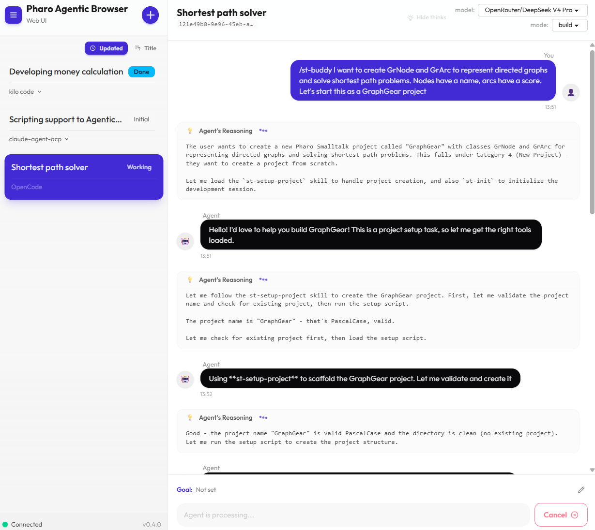

<style>
/* Section divider slides: larger heading */
section.section h2 {
  font-size: 56px;
}
</style>

<!-- _class: title -->
<!-- _paginate: false -->

<style scoped>
section {
  justify-content: center;
  align-items: center;
  gap: 12px;
  text-align: center;
}
section > h1:first-child {
  position: static !important;
  width: auto !important;
  height: auto !important;
  padding-left: 0 !important;
  font-size: 72px;
}
section > h1:first-child::after {
  display: none !important;
}
</style>

# pharo-agentic-browser Web UI

### **Browser-Based Access to Your AI Agent Sessions**
Masashi Umezawa
https://github.com/mumez/pharo-agentic-browser

---

<!-- _class: section -->
<!-- _paginate: false -->

<style>
.highlight-box {
  margin-top: 32px;
  background-color: #e8f0fe;
  border-left: 6px solid var(--blue-very-deep);
  padding: 24px 32px;
  border-radius: 0 8px 8px 0;
  font-size: 30px;
}
</style>

## What is the Web UI?

---

<!-- _class: content-image -->

# Overview

<div class="highlight-box">
An optional package that lets you use <strong>AgenticBrowser</strong> from any web browser.
</div>

- Full topic operations, prompt sending, and more
- Actions that only make sense locally (e.g. package export, working directory setup) are intentionally left out

---

# Use Cases

- **Check in from anywhere at home** — glance at a coding agent's progress from your phone and send the next instruction
- **Headless environments** — servers and containers with no display become usable the moment a browser can reach them

---

<!-- _class: section -->
<!-- _paginate: false -->

## Features

---

# Real-Time Sync via WebSocket (Ripple)

- Powered by [Ripple](https://github.com/mumez/Ripple), a WebSocket framework
- Updates propagate **instantly, without reloading**:
  - New messages
  - New/renamed/deleted topics
  - Edits from other tabs

---

# Mobile Friendly

- Client built with 
  - [SolidJS](https://www.solidjs.com/)
  - [daisyUI](https://daisyui.com/)
- Works smoothly on tablets and smartphones, not just desktop
- Same feature set across screen sizes

---

<!-- _class: section -->
<!-- _paginate: false -->

## Installation & Access

---

# Installation

### Server side

```smalltalk
Metacello new
    baseline: 'AgenticBrowser';
    repository: 'github://mumez/pharo-agentic-browser:main/src';
    load: 'WebUI'.
```

### Client side

Build and deploy the TypeScript client:
https://github.com/mumez/pharo-agentic-browser-web-ui

---

# Starting & Accessing

- Starts automatically when the image launches, or run manually:

```smalltalk
AgenticBrowser startWebUI.
```

- Open in a browser:

```
http://localhost:8080/assets/agentic-browser/
```

---

<!-- _class: section -->
<!-- _paginate: false -->

## Screens

---

<!-- _class: image -->

# Screens — Desktop



---

<!-- _class: column-layout -->

<style scoped>
section.column-layout { justify-content: center; gap: 40px; }
.column { width: auto; text-align: center; }
.column img { height: 560px; }
</style>

# Screens — Mobile

<div class="column">


</div>
<div class="column">


</div>

---

<!-- _class: section -->
<!-- _paginate: false -->

## Functions

---

# Topic & Conversation Functions

| Function | Details |
|----------|---------|
| Topic management | Add, copy, delete |
| Agent config | Change mode, change model |
| Prompting | Send prompt, cancel |
| Approvals | Approve / deny permission requests |

---

# More Functions

- **Sort topics** in the sidebar
- **Hide "thinking" output** for a cleaner chat view
- **Per-topic settings** (e.g. goal-related configuration)
- **Save all** topics on demand

---

<!-- _class: section -->
<!-- _paginate: false -->

## Notifications

---

# Staying Informed

- **Tab title changes** — a `*` or `?` mark appears when something needs your attention
  - `*` - Message added
  - `?` - Confirmation needed
- **Browser Notification API** — pushes a system notification (after granting permission)

<div class="highlight-box">
Accessing over anything other than <code>localhost</code>? Route through a reverse proxy with HTTPS — browsers block notifications on plain HTTP for non-local hosts.
</div>

---

<!-- _class: section -->
<!-- _paginate: false -->

## Settings

---

# Configuration Options

| Setting | Description |
|---------|--------------|
| Port | e.g. `RpServer default settings port: 9090` |
| Bind address | e.g. listen on all interfaces |
| Assets directory | Where the built client is served from |

Configurable via `RpServerSettings` or environment variables.

---

<!-- _class: section -->
<!-- _paginate: false -->

## Summary

---

# Summary

The **Web UI** extends AgenticBrowser beyond the Pharo image:

- **Browser-based** — no Pharo IDE required to check in or respond
- **Real-time** — WebSocket push keeps every tab in sync instantly
- **Mobile friendly** — works comfortably on phones and tablets
- **Same core workflow** — topics, prompts, and approvals, wherever you are

---

<!-- _class: all-text-center align-center -->
<!-- _paginate: false -->

# **Feedback and contributions are welcome!**

https://github.com/mumez/pharo-agentic-browser
