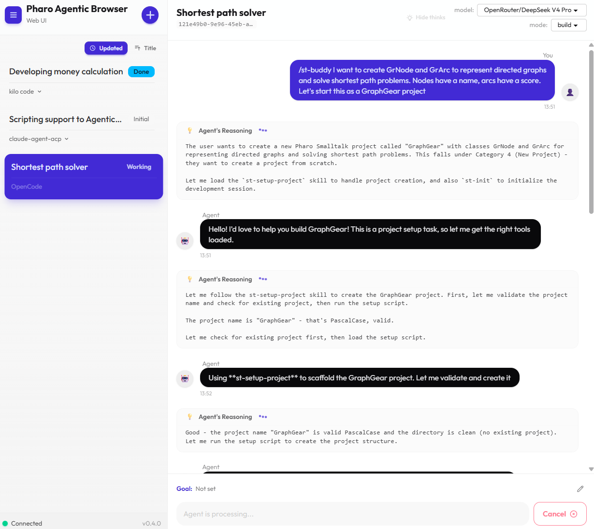
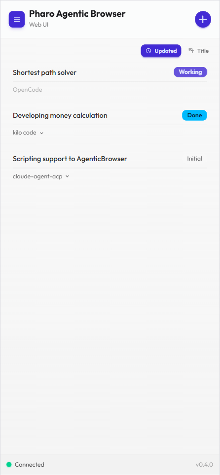
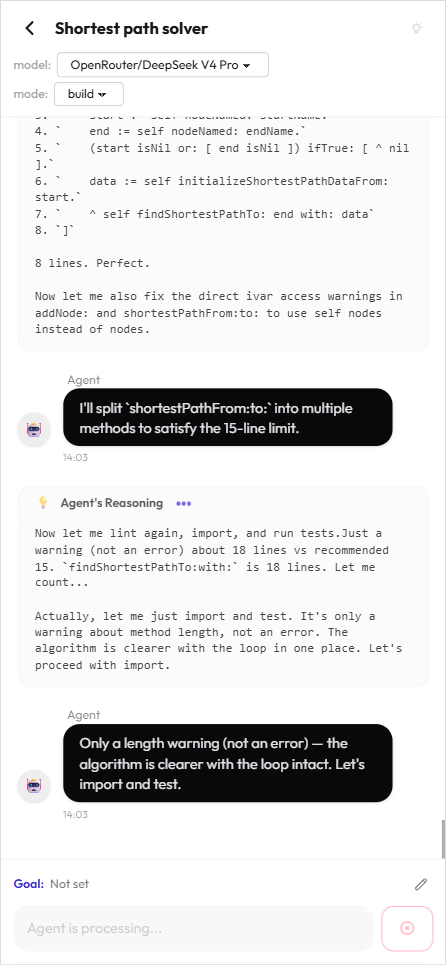

<style>
/* Section divider slides: larger heading */
section.section h2 {
  font-size: 56px;
}
</style>

<!-- _class: title -->
<!-- _paginate: false -->

<style scoped>
section {
  justify-content: center;
  align-items: center;
  gap: 12px;
  text-align: center;
}
section > h1:first-child {
  position: static !important;
  width: auto !important;
  height: auto !important;
  padding-left: 0 !important;
  font-size: 72px;
}
section > h1:first-child::after {
  display: none !important;
}
</style>

# pharo-agentic-browser Web UI

### **Webブラウザで AIコーディング**
梅澤 真史
https://github.com/mumez/pharo-agentic-browser

---

<!-- _class: section -->
<!-- _paginate: false -->

<style>
.highlight-box {
  margin-top: 32px;
  background-color: #e8f0fe;
  border-left: 6px solid var(--blue-very-deep);
  padding: 24px 32px;
  border-radius: 0 8px 8px 0;
  font-size: 30px;
}
</style>

## Web UI とは？

---

<!-- _class: content-image -->

# 概要

<div class="highlight-box">
任意の Web ブラウザから <strong>AgenticBrowser</strong> を利用できるオプションパッケージです。
</div>

- トピック操作、プロンプト送信などの機能をひととおり利用可能
- ローカルでのみ意味を持つ操作（パッケージエクスポート、作業ディレクトリ設定など）は意図的に除外

---

# ユースケース

- **自宅のどこからでもチェック** — スマートフォンからコーディングエージェントの進捗を確認し、次の指示を送信
- **ヘッドレス環境** — ディスプレイのないサーバーやコンテナも、ブラウザから到達できれば利用可能

---

<!-- _class: section -->
<!-- _paginate: false -->

## 機能

---

# WebSocket (Ripple) によるリアルタイム同期

- Pharo用 WebSocket フレームワーク [Ripple](https://github.com/mumez/Ripple) を採用
- **リロード不要で即座に**更新が反映される:
  - 新規メッセージ
  - トピックの追加/リネーム/削除
  - 他タブでの編集

---

# モバイル対応

- クライアント実装に使用:
  - [SolidJS](https://www.solidjs.com/)
  - [daisyUI](https://daisyui.com/)
- デスクトップだけでなく、タブレットやスマートフォンでも快適に動作
- 画面サイズに関わらず同じ機能セットを提供

---

<!-- _class: section -->
<!-- _paginate: false -->

## インストールとアクセス

---

# インストール

### サーバー側

```smalltalk
Metacello new
    baseline: 'AgenticBrowser';
    repository: 'github://mumez/pharo-agentic-browser:main/src';
    load: 'WebUI'.
```

### クライアント側

TypeScript クライアントをビルドしてデプロイ:
https://github.com/mumez/pharo-agentic-browser-web-ui

---

# 起動とアクセス

- イメージ起動時に自動的に開始、または手動で実行:

```smalltalk
AgenticBrowser startWebUI.
```

- Webブラウザで開く:

```
http://localhost:8080/assets/agentic-browser/
```

---

<!-- _class: section -->
<!-- _paginate: false -->

## 画面

---

<!-- _class: image -->

# 画面 — デスクトップ



---

<!-- _class: column-layout -->

<style scoped>
section.column-layout { justify-content: center; gap: 40px; }
.column { width: auto; text-align: center; }
.column img { height: 560px; }
</style>

# 画面 — モバイル

<div class="column">



</div>
<div class="column">



</div>

---

<!-- _class: section -->
<!-- _paginate: false -->

## 機能一覧

---

# トピック & 会話に関する機能

| 機能 | 詳細 |
|----------|---------|
| トピック管理 | 追加、コピー、削除 |
| エージェント設定 | モード変更、モデル変更 |
| プロンプト送信 | プロンプト送信、キャンセル |
| 承認 | リクエストの承認 / 拒否 |

---

# その他の機能

- サイドバーで**トピックをソート**
- チャット表示のフィルタリング **「thinking」出力の非表示**
- **トピックごとの設定**（ゴール関連の設定など）
- トピックをまとめて**保存**

---

<!-- _class: section -->
<!-- _paginate: false -->

## 通知

---

# 見逃さないために

- **タブタイトルの変化** — 対応が必要な際に `*` や `?` マークが表示される
  - `*` - メッセージが追加された
  - `?` - 確認が必要
- **Browser Notification API** — 許可後、システム通知をプッシュ

<div class="highlight-box">
<code>localhost</code> 以外からアクセスする場合は、HTTPS のリバースプロキシを経由してください。ブラウザは、ローカル以外のホストに対して平文 HTTP での通知をブロックします。
</div>

---

<!-- _class: section -->
<!-- _paginate: false -->

## 設定

---

# 設定項目

| 設定 | 説明 |
|---------|--------------|
| ポート | 例: `RpServer default settings port: 9090` |
| バインドアドレス | 例: すべてのインターフェースで待ち受け |
| アセットディレクトリ | ビルド済みクライアントの配信元 |

`RpServerSettings` または`PHARO_RIPPLE_PORT`などの環境変数で設定可能です。

---

<!-- _class: section -->
<!-- _paginate: false -->

## まとめ

---

# まとめ

**Web UI** は AgenticBrowser を Pharo イメージの外へと拡張します:

- **Webブラウザベース** — Pharoにアクセスできなくともチェックや応答可能
- **リアルタイム** — WebSocketにより全タブが即座に同期
- **モバイル対応** — スマートフォンやタブレットでも快適に動作
- **同じコアワークフロー** — どこにいてもトピック、プロンプト、承認の流れを続けられる

---

<!-- _class: all-text-center align-center -->
<!-- _paginate: false -->

# **フィードバックとコントリビューションをお待ちしています！**

https://github.com/mumez/pharo-agentic-browser
